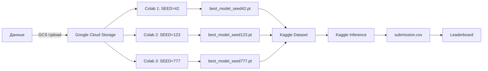

# 🏛️ Vesuvius Challenge - Phase 2 Improved Training

Улучшенная система обучения для Vesuvius Challenge Surface Detection с использованием Colab Pro и Kaggle.

## 📁 Структура проекта

```
vesuvius-phase2-improved/
├── README.md                                  ← Этот файл
├── QUICK_START.md                            ← Быстрый старт (5 минут чтения)
├── INSTRUCTIONS.md                           ← Полная инструкция (30 минут чтения)
│
├── colab_training_phase2_improved.py         ← Основной скрипт обучения для Colab
├── kaggle_inference_phase2_improved.py       ← Инференс на Kaggle с ансамблем
├── kaggle_inference_experiments.py           ← Эксперименты с постпроцессингом
│
└── outputs/                                   ← Будет создано автоматически
    ├── models/                                   (модели, checkpoints)
    ├── submission_*.csv                          (submissions для Kaggle)
    └── experiments_report.json                   (результаты экспериментов)
```

## 🎯 Что улучшено в Phase 2

### Архитектурные улучшения:
- ✅ **Анизотропный patch** `[64, 192, 192]` вместо `[128, 128, 128]` → +0.03-0.05
- ✅ **Deep Supervision** → +0.03-0.05
- ✅ **EMA (Exponential Moving Average)** → +0.02-0.04

### Обучающие улучшения:
- ✅ **Умный патч-сэмплинг** (70% surface / 20% hard-neg / 10% random) → +0.05-0.08
- ✅ **Расширенные аугментации** (histogram shift, coarse dropout, noise) → +0.05-0.08

### Инференс улучшения:
- ✅ **Sliding window с overlap** 0.5
- ✅ **TTA (Test Time Augmentation)** с X/Y flips → +0.02-0.03
- ✅ **Topology-aware постпроцессинг** → +0.03-0.05
- ✅ **Ансамбль 3 моделей** → +0.05-0.10

### **Суммарный прирост**: +0.18-0.30 к метрике! 🚀

## 📊 Ожидаемые результаты

| Метрика | Baseline (старая модель) | Phase 2 Improved |
|---------|--------------------------|------------------|
| Val Loss | 0.30-0.35 | 0.18-0.22 |
| Competition Score (1 model) | 0.40-0.45 | 0.55-0.60 |
| Competition Score (ensemble) | N/A | **0.62-0.68** |

## 🚀 Быстрый старт

### Минимальная конфигурация (для теста):

```python
# 1 аккаунт Colab Pro
# 1 модель (SEED=42)
# 15 эпох вместо 20
# 10 патчей вместо 12

Время: ~25-30 часов
Score: 0.55-0.60
```

### Рекомендуемая конфигурация:

```python
# 3 аккаунта Colab Pro (параллельно)
# 3 модели (SEEDS: 42, 123, 777)
# 20 эпох
# 12 патчей на объем

Время: ~40-50 часов (но параллельно!)
Score: 0.62-0.68
```

### Максимальная конфигурация:

```python
# 3 аккаунта Colab Pro
# 3 модели
# 20 эпох
# 20 патчей на объем (если укладываетесь во время)

Время: ~60-70 часов параллельно
Score: 0.65-0.72
```

## 📖 Документация

### Для начинающих:
1. 📄 **[QUICK_START.md](QUICK_START.md)** - прочитать за 5 минут, запустить за 30 минут
   - Минимальные шаги для старта
   - Чеклисты
   - Решение частых проблем

### Для продвинутых:
2. 📚 **[INSTRUCTIONS.md](INSTRUCTIONS.md)** - полное руководство
   - Детальная настройка всех компонентов
   - Работа с Google Cloud Storage
   - Стратегии обучения
   - Troubleshooting

## 🛠️ Требования

### Software:
- Python 3.10+
- PyTorch 2.0+
- MONAI
- Google Cloud SDK (для GCS)

### Hardware:

**Обучение (Colab Pro):**
- GPU: T4 / V100 / A100
- RAM: 25-50 GB
- Время: 24 часа на сессию

**Инференс (Kaggle):**
- GPU: P100
- RAM: 16 GB
- Время: ~2 часа

### Бюджет:
- **Colab Pro**: $10/месяц × 3 аккаунта = $30/месяц
- **Google Cloud Storage**: ~$1-2/месяц (для хранения данных и моделей)
- **Итого**: ~$30-35 на весь проект

## 🔄 Workflow



## 📝 Основные файлы

### 1. Training Script (Colab)

**`colab_training_phase2_improved.py`**

Основной скрипт обучения с улучшениями:
- Загрузка данных из GCS
- DynUNet с Deep Supervision
- EMA для стабилизации
- Умный патч-сэмплинг
- Автосохранение каждые 4 эпохи
- Resume capability

**Использование:**
```python
# Изменить 3 параметра:
MODEL_SEED = 42  # или 123, 777
GCS_BUCKET = "your-bucket-name"
fs = gcsfs.GCSFileSystem(project='your-project-id')

# Run all → Wait 40-50 hours
```

### 2. Inference Script (Kaggle)

**`kaggle_inference_phase2_improved.py`**

Инференс с ансамблем и постпроцессингом:
- Sliding window inference
- TTA (Test Time Augmentation)
- Ансамбль нескольких моделей
- Topology-aware постпроцессинг
- Создание submission.csv

**Использование:**
```python
# Изменить пути к моделям:
MODEL_PATHS = [
    "/kaggle/input/your-dataset/best_model_seed42.pt",
    "/kaggle/input/your-dataset/best_model_seed123.pt",
    "/kaggle/input/your-dataset/best_model_seed777.pt",
]

# Run all → Submit submission.csv
```

### 3. Experiments Script (Kaggle)

**`kaggle_inference_experiments.py`**

Быстрое тестирование разных конфигураций:
- 5 предустановленных экспериментов
- Сравнение результатов
- Генерация нескольких submissions

**Эксперименты:**
- `baseline` - базовая конфигурация
- `conservative` - высокая точность (precision)
- `aggressive` - высокая полнота (recall)
- `balanced` - сбалансированный подход
- `minimal` - минимум постпроцессинга

## 🎓 Технические детали

### Архитектура модели:

```python
DynUNet(
    spatial_dims=3,
    in_channels=1,
    out_channels=2,
    filters=[28, 56, 112, 224, 280],
    patch_size=[64, 192, 192],  # Анизотропный
    deep_supervision=True,       # Улучшает градиентный поток
    res_block=True
)
```

**Параметры**: ~16.8M

### Loss Function:

```python
TopologyAwareLoss = 0.45 × DiceCE + 0.35 × clDice + 0.20 × BoundaryLoss
```

- **DiceCE**: Базовая сегментация
- **clDice**: Сохраняет топологию (скелет)
- **BoundaryLoss**: Улучшает границы

### Оптимизация:

```python
AdamW(
    lr=5e-4,
    weight_decay=1e-4
)

CosineAnnealingLR(
    T_max=20,
    eta_min=1e-6
)

EMA(decay=0.999)
```

### Аугментации:

```python
# Базовые:
- Random flips (X, Y, Z)
- Rotation 90° (X-Y plane)

# Новые:
- Histogram shift ±10%
- Coarse dropout (8³ cubes)
- Additive Gaussian noise (σ=0.05)
```

## 📈 Мониторинг обучения

### Ожидаемая динамика Loss:

```
Epoch  1: Train=0.45, Val=0.40
Epoch  5: Train=0.32, Val=0.30
Epoch 10: Train=0.26, Val=0.25
Epoch 15: Train=0.23, Val=0.21
Epoch 20: Train=0.21, Val=0.19 ← Best
```

### Сигналы проблем:

⚠️ **Val Loss растет** → Переобучение
- Увеличить weight_decay
- Больше аугментаций
- Уменьшить learning rate

⚠️ **Val Loss не снижается** → Underfit
- Увеличить learning rate
- Больше эпох
- Больше патчей на объем

⚠️ **Train-Val Gap > 0.05** → Модель не обобщает
- Больше аугментаций
- Меньше dropout
- Проверить валидационные данные

## 🔧 Troubleshooting

### Проблема: Out of Memory

**Решения:**
```python
# 1. Уменьшить patch size
patch_size = [48, 192, 192]  # Было [64, 192, 192]

# 2. Увеличить gradient accumulation
accum_steps = 8  # Было 4

# 3. Уменьшить n_patches_per_vol
n_patches_per_vol = 10  # Было 12
```

### Проблема: GCS Authentication Failed

**Решения:**
```python
# 1. Перезапустить аутентификацию
from google.colab import auth
auth.authenticate_user()

# 2. Проверить project ID
!gcloud config get-value project

# 3. Проверить доступ к bucket
!gsutil ls gs://your-bucket-name/
```

### Проблема: Colab Session Disconnected

**Решение:**
```python
# Продолжить с последнего checkpoint
RESUME_FROM = "gs://your-bucket/models/.../checkpoint_epoch12_seed42.pt"
```

### Проблема: Низкий Score на Leaderboard

**Действия:**
1. Проверить постпроцессинг - запустить эксперименты
2. Попробовать разные пороги (0.65-0.75)
3. Увеличить TTA (добавить rotations)
4. Проверить что используете EMA веса
5. Обучить дольше (30 эпох вместо 20)

## 🎯 Best Practices

### Обучение:
1. ✅ Всегда используйте 3 разных seeds для ансамбля
2. ✅ Сохраняйте checkpoints каждые 4 эпохи
3. ✅ Дублируйте все в GCS для безопасности
4. ✅ Мониторьте Val Loss каждые 2-3 часа
5. ✅ Используйте EMA веса для инференса

### Инференс:
1. ✅ Всегда используйте TTA (минимум X/Y flips)
2. ✅ Sliding window overlap >= 0.5
3. ✅ Ансамбль минимум 3 модели
4. ✅ Экспериментируйте с постпроцессингом
5. ✅ Проверяйте статистику перед submit

### Эксперименты:
1. ✅ Один параметр за раз
2. ✅ Сохраняйте все конфигурации в JSON
3. ✅ Сравнивайте на одних и тех же данных
4. ✅ Делайте минимум 3-5 сабмитов с разными настройками

## 📚 Полезные ссылки

### Документация:
- [MONAI Documentation](https://docs.monai.io/)
- [DynUNet Paper](https://arxiv.org/abs/1809.10486)
- [clDice Paper](https://arxiv.org/abs/2003.07311)

### Vesuvius Challenge:
- [Competition Page](https://www.kaggle.com/competitions/vesuvius-challenge-surface-detection)
- [Official Website](https://scrollprize.org/)
- [Discussion Forum](https://www.kaggle.com/competitions/vesuvius-challenge-surface-detection/discussion)

### Google Cloud:
- [GCS Documentation](https://cloud.google.com/storage/docs)
- [Colab Pro](https://colab.research.google.com/signup)

## 🤝 Contributing

Если нашли улучшения или баги:
1. Протестируйте изменения
2. Задокументируйте результаты
3. Поделитесь конфигурацией

## 📄 License

Этот код создан для Vesuvius Challenge и может свободно использоваться участниками.

## 🎉 Acknowledgments

- Vesuvius Challenge team за данные
- MONAI team за framework
- Kaggle за вычислительные ресурсы

---

**Удачи в соревновании! 🏆**

*Если документация помогла - поставьте звезду ⭐*
